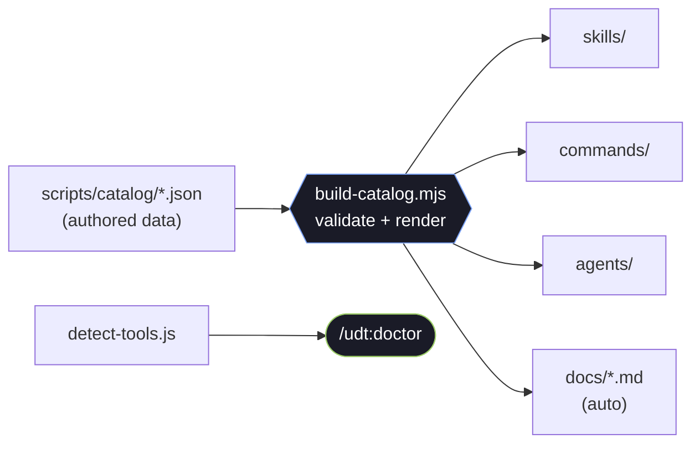

<div align="center">


<p>
  
  
  
  
</p>

<p>
  
  
  
  
  
  <a href="https://github.com/kaazyxx/ultimate-dev-toolkit/stargazers"></a>
</p>

<samp><b><a href="#install">Install</a> · <a href="#quick-start">Quick start</a> · <a href="#whats-inside">What's inside</a> · <a href="#how-it-fits-together">How it works</a> · <a href="#extending">Extending</a> · <a href="docs/">Docs</a></b></samp>

<br/>

<em>skills · slash commands · specialist agents · safety hooks · MCP connectors —<br/>
for coding, git, Docker, databases, security, testing, DevOps, cloud, data/ML and more.</em>

</div>

<br/>

## Why UDT

|  |  |
| --- | --- |
| **Security-first** | Destructive actions confirm first, arguments are validated, secrets are redacted, and an audit trail is kept. Protections are never disabled to make a command "more powerful". |
| **Honest detection** | Never claims a language or tool is supported unless it is actually installed. `/udt:doctor` runs real version probes and reports only what is truly present. |
| **Modular & data-driven** | The whole catalog is generated from small JSON files — add a skill/command/agent without touching the core. Scales to hundreds of capabilities. |
| **Universal** | 40+ languages, full-stack web, databases, DevOps, cloud, data/ML/AI, security, mobile, desktop, 3D/Blender… |

> [!NOTE]
> UDT is **not** a compiled program. It's a set of Markdown instructions and manifests that
> Claude Code loads: **skills** (playbooks it reads on demand), **slash commands**
> (`/category:name`), **subagents** (focused reviewers with their own context), **hooks**
> (safety guards) and **connectors** (MCP servers). Every skill/command/agent is a real,
> content-ful file — not an empty stub.

<br/>

## Install

> Requires **Node.js 18+** (for `/udt:doctor`, the catalog generator and the advisory hooks). Everything else is optional and detected at runtime.

UDT is a standard Claude Code plugin, so it installs the same way everywhere — pick your client/source below, then run the two commands in a Claude Code session.

<details open>
<summary><b>Option 1 — Claude Desktop app</b></summary>

<br/>

1. Open a **Code** session in the Claude desktop app.
2. In the chat box, add the marketplace and install:
   ```
   /plugin marketplace add kaazyxx/ultimate-dev-toolkit
   /plugin install ultimate-dev-toolkit
   ```
3. Approve the install dialog. You can toggle/manage it anytime from the **Plugins** panel.

Full walkthrough → [docs/claude-desktop.md](docs/claude-desktop.md)
</details>

<details>
<summary><b>Option 2 — Claude Code CLI (terminal)</b></summary>

<br/>

```
/plugin marketplace add kaazyxx/ultimate-dev-toolkit
/plugin install ultimate-dev-toolkit
```
</details>

<details>
<summary><b>Option 3 — Claude Code on the web</b></summary>

<br/>

Same two commands in a web Code session:

```
/plugin marketplace add kaazyxx/ultimate-dev-toolkit
/plugin install ultimate-dev-toolkit
```
</details>

<details>
<summary><b>Option 4 — From a local clone</b></summary>

<br/>

```bash
git clone https://github.com/kaazyxx/ultimate-dev-toolkit
```
```
/plugin marketplace add /absolute/path/to/ultimate-dev-toolkit
/plugin install ultimate-dev-toolkit
```
</details>

Then verify your environment:

```
/udt:doctor      # what's installed + which skills apply
/udt:help        # browse every command
```

Full guide → [docs/installation.md](docs/installation.md)

<br/>

## Quick start

```bash
/udt:doctor
/dev:analyze ./src                                  # language, framework, risks
/dev:debug --file app.py --line 42 --error "KeyError: user"
/git:review                                         # review changes before commit
/security:audit                                     # deps + secrets + misconfig
/dev:test --path ./src                              # detect the runner and run tests
```

<br/>

## What's inside

<div align="center">


</div>

### Commands — `/category:name`

| Category | Commands |
| --- | --- |
| **udt** | `doctor` · `help` · `registry` · `config` |
| **dev** | `analyze` · `debug` · `refactor` · `review` · `test` · `fix` · `generate` · `document` · `optimize` · `explain` · `scaffold` · `translate` · … |
| **git** | `status` · `review` · `commit` · `diff` · `log` · `branch` · `bisect` · `undo` · `sync` · `pr-prep` · … |
| **db** | `inspect` · `query` · `schema` · `optimize` · `migrate` · `backup` · `seed` |
| **docker** | `inspect` · `build` · `logs` · `troubleshoot` · `compose` · `cleanup` |
| **security** | `audit` · `secrets` · `deps` · `headers` · `permissions` · `threat-model` |
| **cloud / aws / azure / gcp / k8s / tf** | `whoami` · `s3` · `ec2` · `iam-audit` · `pods` · `logs` · `rollout` · `plan` · … |
| **files · system · pipeline · project · ci · test · api** | search · inspect · run · detect · coverage · design · … |

Full reference → [docs/commands.md](docs/commands.md)

### Skills

<details>
<summary><b>353 skills across 15+ domains</b> (click to expand)</summary>

<br/>

- **Core** — environment-detection, safe-execution, command-registry, pipelines
- **Engineering** — code-analysis, debugging, refactoring, code-generation, testing-strategy, performance-profiling, …
- **Languages (40+)** — python, typescript, rust, go, cpp, java, kotlin, swift, csharp, ruby, php, elixir, haskell, solidity, assembly, cobol, … + shell/sql
- **Web** — react, vue, angular, svelte, next, nuxt, astro + node/express/nestjs/fastapi/django/spring/laravel/rails backends
- **Databases** — postgres, mysql, sqlite, mongodb, redis, cassandra, dynamodb, clickhouse, neo4j, …
- **DevOps** — docker, kubernetes, helm, terraform, ansible, CI/CD, observability, SRE, …
- **Cloud** — aws, azure, gcp, cloudflare, serverless, cost-optimization
- **Data / ML / AI** — pandas, spark, dbt, pytorch, tensorflow, MLOps, RAG, embeddings, LLM agents/eval
- **Security** — OWASP, secrets, dependencies, supply-chain, SAST/DAST, threat-modeling, …
- **Mobile / Desktop** — iOS, Android, Flutter, React Native, Electron, Tauri, Qt, …
- **3D / graphics** — texture-3d (PBR), blender-mcp
- **Architecture · Quality · Testing · Tooling · Automation · Networking**

Full reference → [docs/skills.md](docs/skills.md)
</details>

### Agents, hooks, connectors

- **72 agents** — `code-reviewer`, `debug-detective`, `security-auditor`, per-language reviewers & build-resolvers → [docs/agents.md](docs/agents.md)
- **27 hooks** — advisory safety guards (destructive-command & secret-write reminders) + an audit trail, one fast dispatcher, **never block by default** → [docs/security.md](docs/security.md)
- **4 connectors** — `sequential-thinking` · `memory` · `filesystem` · `blender` (MCP servers)

<br/>

## How it fits together

The catalog is authored as data; a generator validates it and emits every file **plus** the reference docs — the command registry and auto-documentation in one.



Rebuild after editing the catalog:

```bash
npm run build    # regenerate skills/commands/agents + docs
npm test         # structural checks + count thresholds + load-test
npm run doctor   # environment report
```

<br/>

## Extending

Add a capability by editing `scripts/catalog/*.json` and rebuilding, or ship a self-contained
extension under [`extensions/`](extensions/README.md) (a working template is included).

```jsonc
// scripts/catalog/skills.mine.json
[{ "name": "my-skill", "category": "tooling",
   "description": "One clear sentence on WHEN to use this (drives auto-loading).",
   "tools": ["some-cli"], "commands": ["some-cli --version"] }]
```

Guide → [docs/extending.md](docs/extending.md)

<br/>

## Documentation

| Doc | Purpose |
| --- | --- |
| [architecture.md](docs/architecture.md) | How the pieces fit together |
| [installation.md](docs/installation.md) · [claude-desktop.md](docs/claude-desktop.md) | Install & the doctor check |
| [configuration.md](docs/configuration.md) | `udt.config.yaml` reference |
| [security.md](docs/security.md) | Threat model & safety guarantees |
| [extending.md](docs/extending.md) | Build a skill / command / agent / extension |
| [troubleshooting.md](docs/troubleshooting.md) | Common problems |
| [skills.md](docs/skills.md) · [commands.md](docs/commands.md) · [agents.md](docs/agents.md) | Generated reference |

<br/>

<div align="center">

### License

MIT — see [LICENSE](LICENSE).

<sub>built to be honest — capabilities equal what's actually installed.</sub>


</div>
